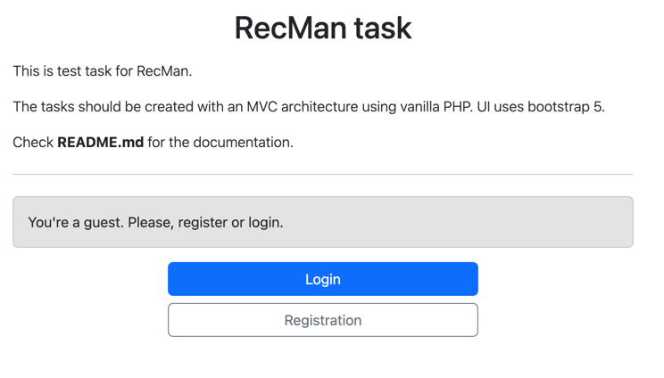
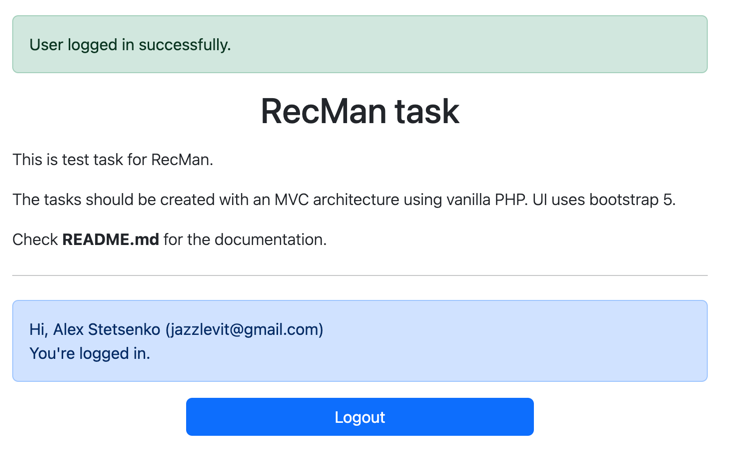
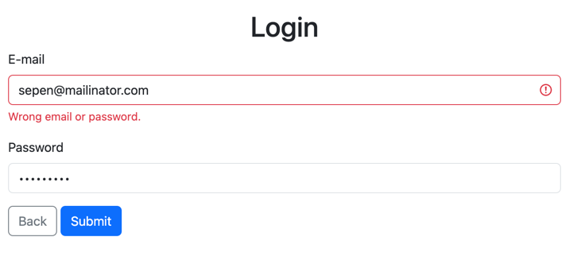
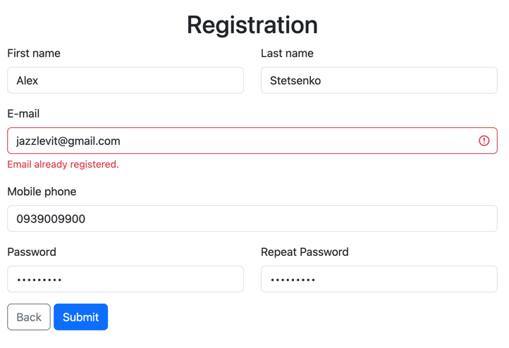

# R-tech task (vanilla php)

## Task Description
- create a registration and a login forms
- using only vanilla PHP (no frameworks)
- use MVC pattern
- bootstrap for design

## Set up configuration
- install composer dependencies  
`composer install`

- copy config file and set up db connection

`cp config/config.php.example config/config.php`

- open config/config.php and set up db connection

```php
define('DB_HOST', 'localhost');
define('DB_USER', 'root');
define('DB_PASS', 'root');
define('DB_NAME', 'recman');
```

- run sql script in created database - `migrations/create_tables.sql` that will create `users` table

- set up a server, open `public` as root, for instance:

```
cd public
php -S localhost:8000
```

open `http://localhost:8000` in your browser

## Examples:

### index page

GET /index.php - main page (Guest or Authorized)

Page as Guest



Page as Authorized



### login page

GET /login.php - login form (Guest)

POST /login.php - sending login form (Guest)



### registration page

GET /registration.php - registration form (Guest)

POST /registration.php - sending registration form (Guest)



## TODO (improvements)
- routing system
- validation system
  - better mobile_phone validation
- authorization protection system
- write auto tests
